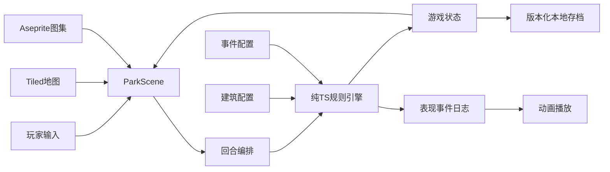
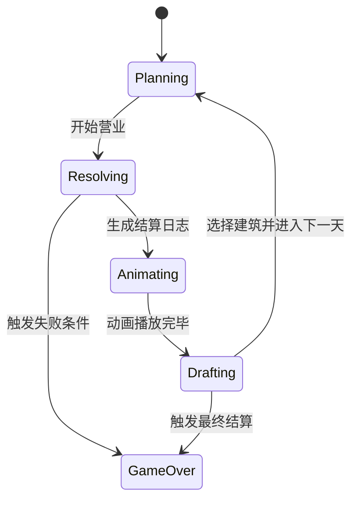

# 修仙游乐园（Xian Park）纯 Web 技术设计文档

## 1. 文档目标

本文档定义《修仙游乐园》Game Jam 版本的技术方案。首版目标是：

- 运行于现代 PC 浏览器，横屏游玩。
- 无后端、无账号系统，可部署为纯静态网站。
- 单局核心地图为 8×6，共 48 格。
- 约 15 种建筑，采用数据驱动方式实现。
- 一天约 30 秒，完成放置、联动、营业、结算和三选一。
- 优先保证玩法完整、数值易调试和快速迭代。

首版不处理多人联机、云存档、排行榜、地图编辑器内置化和复杂寻路。移动端与 PWA 作为后续扩展，不属于 Game Jam 必做范围。

## 2. 技术栈

### 2.1 核心技术

- **Vite**：开发服务器、资源处理和生产构建。
- **TypeScript**：游戏状态、规则系统、配置约束和工具代码。
- **Phaser**：Canvas/WebGL 渲染、输入、场景、动画、摄像机和基础音频。
- **Tiled**：编辑底图、道路、入口、出口和游客路线标记。
- **Aseprite**：制作像素角色、建筑、特效和图标，并导出图集。
- **Vitest**：测试不依赖 Phaser 的纯规则系统。

### 2.2 可选技术

- **Howler**：仅在需要独立于 Phaser 场景管理长音乐、复杂混音或跨场景无缝音频时启用。
- **Lottie / lottie-web**：仅用于开场 Logo、结算庆祝等 DOM 覆盖层动画。

Phaser 本身已经提供 Web Audio 支持。MVP 默认统一使用 `this.sound`，不同时维护 Phaser Sound 和 Howler 两套音频状态。Lottie 也不用于地图内动画，避免 Canvas 坐标与 DOM 坐标同步。

### 2.3 明确不引入

- React、Vue 等 UI 框架。
- Redux、Zustand 等通用状态库。
- ECS 框架。
- Node.js 后端和数据库。
- 运行时通用脚本语言或过度抽象的规则 DSL。

项目规模较小，Phaser 场景加纯 TypeScript 模块足够覆盖需求。减少依赖可以缩短 Game Jam 集成和排错时间。

## 3. 平台与显示规范

- 设计分辨率：`1280 × 720`。
- 屏幕方向：横屏。
- 缩放策略：`Phaser.Scale.FIT`。
- 居中策略：`Phaser.Scale.CENTER_BOTH`。
- 像素美术：关闭纹理平滑，启用 `pixelArt: true`。
- 推荐浏览器：当前稳定版 Chrome、Edge、Firefox。
- 最低可接受视口：`960 × 540`。

画面可分为三个区域：

1. 左侧或中央为 8×6 乐园棋盘。
2. 右侧为当前天数、灵石、游客和建筑详情。
3. 底部为建筑手牌、升级和开始营业按钮。

所有核心操作均使用鼠标完成。键盘快捷键可以后续补充，但不应成为必要操作。

## 4. 总体架构



架构分为五层：

1. **表现层**：Phaser 场景、精灵、Tween、粒子、面板和输入。
2. **流程层**：控制一天内各阶段切换，禁止非法操作。
3. **规则层**：计算建筑联动、游客消费、满意度和最终收益。
4. **数据层**：建筑、游客类型、每日事件和数值配置。
5. **基础设施层**：资源加载、随机数、存档、音频和调试日志。

最重要的约束是：规则层不得引用 `Phaser`。同一个输入状态和随机种子必须得到同一个结算结果。

## 5. 场景划分

### BootScene

- 设置缩放、背景色和全局注册项。
- 加载预加载界面必需的最小资源。
- 完成后进入 `PreloadScene`。

### PreloadScene

- 加载 Tiled 地图、Tileset、建筑图集、游客图集、UI 和音频。
- 展示加载进度与失败提示。
- 完成后进入主菜单。

### MainMenuScene

- 新游戏。
- 继续游戏。
- 音量设置。
- 制作人员。

### ParkScene

- 承载地图、建筑、游客和主要 UI。
- 接收玩家的选择、放置、升级和开始营业操作。
- 调用回合编排器，但不直接实现收益规则。
- 按结算日志依次播放游客移动、消费和收益飘字。

### ResultScene

- 展示本局天数、总收入、最高连携和失败原因。
- 支持重新开始或返回主菜单。

MVP 可以将 `MainMenuScene` 和 `ResultScene` 做得很轻，但不建议把全部逻辑堆在单个场景中。

## 6. 建议目录结构

```text
xiuxian-youleyuan/
├─ public/
│  └─ assets/
│     ├─ maps/
│     ├─ tilesets/
│     ├─ atlases/
│     ├─ audio/
│     └─ lottie/
├─ src/
│  ├─ main.ts
│  ├─ game/
│  │  ├─ config.ts
│  │  ├─ scenes/
│  │  │  ├─ BootScene.ts
│  │  │  ├─ PreloadScene.ts
│  │  │  ├─ MainMenuScene.ts
│  │  │  ├─ ParkScene.ts
│  │  │  └─ ResultScene.ts
│  │  ├─ controllers/
│  │  │  └─ TurnController.ts
│  │  ├─ systems/
│  │  │  ├─ PlacementSystem.ts
│  │  │  ├─ SynergySystem.ts
│  │  │  ├─ VisitorSystem.ts
│  │  │  ├─ EconomySystem.ts
│  │  │  ├─ DraftSystem.ts
│  │  │  └─ EventSystem.ts
│  │  ├─ models/
│  │  │  ├─ game-state.ts
│  │  │  ├─ building.ts
│  │  │  ├─ visitor.ts
│  │  │  ├─ daily-event.ts
│  │  │  └─ effect.ts
│  │  ├─ data/
│  │  │  ├─ buildings.ts
│  │  │  ├─ visitors.ts
│  │  │  ├─ daily-events.ts
│  │  │  └─ balance.ts
│  │  ├─ rendering/
│  │  │  ├─ BoardView.ts
│  │  │  ├─ BuildingView.ts
│  │  │  ├─ VisitorView.ts
│  │  │  └─ AnimationPlayer.ts
│  │  └─ services/
│  │     ├─ AssetService.ts
│  │     ├─ AudioService.ts
│  │     ├─ SaveService.ts
│  │     └─ RandomService.ts
│  ├─ ui/
│  │  ├─ Hud.ts
│  │  ├─ BuildingCard.ts
│  │  ├─ Tooltip.ts
│  │  └─ Modal.ts
│  └─ styles/
│     └─ global.css
├─ tests/
│  ├─ synergy.test.ts
│  ├─ visitors.test.ts
│  ├─ economy.test.ts
│  └─ save.test.ts
├─ index.html
├─ package.json
├─ tsconfig.json
└─ vite.config.ts
```

Phaser 内的 HUD 可以先用 `Container`、`Text` 和 `NineSlice` 实现。只有可选 Lottie 层和基础页面壳使用 DOM。

## 7. 核心状态模型

以下类型用于说明边界，实际实现时可以拆分到对应文件。

```ts
type GridPosition = {
  x: number;
  y: number;
};

type BuildingCategory = "ride" | "shop" | "buff" | "utility";
type BuildingRarity = "common" | "uncommon" | "rare" | "epic" | "legendary";
type BuildingTag =
  | "sword"
  | "flight"
  | "speed"
  | "thunder"
  | "ghost"
  | "beast"
  | "food"
  | "meditation"
  | "stimulating";

type BuildingDefinition = {
  id: string;
  name: string;
  category: BuildingCategory;
  tags: BuildingTag[];
  rarity: BuildingRarity;
  baseCost: number;
  baseRevenue: number;
  levelRevenue: number[];
  spriteFrame: string;
  effects: EffectSpec[];
};

type BuildingInstance = {
  instanceId: string;
  definitionId: string;
  position: GridPosition;
  level: number;
  disabledDays: number;
};
```

建筑定义是只读配置，建筑实例只保存本局变化。不要把名称、图标和基础收益复制进存档。

```ts
type Sect = "sword" | "alchemy" | "buddhist" | "demonic" | "demon" | "ghost";

type VisitorState = {
  id: string;
  sect: Sect;
  wallet: number;
  satisfaction: number;
  thrill: number;
  fatigue: number;
  remainingStops: number;
};

type GamePhase =
  | "planning"
  | "resolving"
  | "animating"
  | "drafting"
  | "gameOver";

type GameState = {
  schemaVersion: number;
  runId: string;
  seed: number;
  rngCursor: number;
  day: number;
  phase: GamePhase;
  spiritStones: number;
  visitorCount: number;
  board: Array<BuildingInstance | null>;
  ownedBuildingIds: string[];
  activeEventId: string | null;
  pendingDraft: string[];
  statistics: RunStatistics;
};
```

`board` 固定为 48 项的一维数组，索引换算如下：

```ts
const indexOf = (x: number, y: number): number => y * 8 + x;
```

固定尺寸下，一维数组比稀疏对象更简单，也便于序列化和遍历。

## 8. 建筑效果模型

不建议让每座建筑执行任意回调，否则配置会逐渐变成散落的特殊逻辑。MVP 使用有限的可辨识联合类型：

```ts
type EffectSpec =
  | {
      kind: "adjacentRevenueMultiplier";
      value: number;
      targetTags?: BuildingTag[];
    }
  | {
      kind: "globalTagRevenueMultiplier";
      value: number;
      targetTags: BuildingTag[];
    }
  | {
      kind: "extraVisitorStops";
      value: number;
    }
  | {
      kind: "restoreFatigue";
      value: number;
    }
  | {
      kind: "repeatPurchaseChance";
      chance: number;
    }
  | {
      kind: "preventNegativeEvent";
      radius: number;
    }
  | {
      kind: "nextDayVisitorBonus";
      value: number;
    }
  | {
      kind: "failureRevenueRatio";
      value: number;
      targetTags: BuildingTag[];
    };
```

每种 `kind` 对应规则引擎中的一个处理器。新增机制时先判断能否由现有效果组合实现；确实不同才增加新的联合成员和处理器。

建筑配置示意：

```ts
const spiritGatheringArray: BuildingDefinition = {
  id: "spirit-gathering-array",
  name: "聚灵阵",
  category: "buff",
  tags: ["meditation"],
  rarity: "uncommon",
  baseCost: 60,
  baseRevenue: 0,
  levelRevenue: [0, 0, 0, 0],
  spriteFrame: "building/spirit-gathering-array",
  effects: [
    {
      kind: "adjacentRevenueMultiplier",
      value: 0.15,
    },
  ],
};
```

配置在开发期使用 TypeScript 而非外部 JSON，以获得联合类型检查、自动补全和重构能力。若后续需要策划热更新，再导出为 JSON 并增加运行时校验。

## 9. 地图与放置系统

### 9.1 Tiled 职责

Tiled 地图包含：

- `Ground`：地面 Tile Layer。
- `Decoration`：不参与规则的装饰 Tile Layer。
- `Blocked`：不可放置区域，可使用 Tile Layer 或对象属性。
- `Route`：游客路径对象层。
- `Markers`：入口、出口和特殊位置对象层。

地图自定义属性：

- `gridWidth = 8`
- `gridHeight = 6`
- `tileSize = 96`
- `mapId = park-01`

`Route` 中每个路径点设置整数属性 `order`。运行时按 `order` 排序生成固定路线，不做 A* 寻路。这与“游客固定路线”的设计目标一致，也更稳定。

### 9.2 运行时职责

TypeScript 网格模型负责：

- 检查坐标是否越界。
- 检查地块是否被占用或禁止放置。
- 根据上下左右四个方向查询邻居。
- 写入、移动或升级建筑实例。
- 计算建筑对路线和相邻建筑的影响。

Tiled 不保存玩家运行时放置的建筑。存档只保存建筑定义 ID、位置、等级和临时状态。

## 10. 一天的状态机



### Planning

- 玩家选择、放置和升级建筑。
- 可查看相邻加成预览和预计基础收益。
- 点击“开始营业”后锁定棋盘。

### Resolving

- 复制当天结算快照。
- 应用每日事件。
- 计算建筑联动。
- 生成游客。
- 模拟游客沿固定路线行动。
- 结算收入、满意度和罚款。
- 生成只读表现事件日志。

该阶段应在一个同步规则调用中完成，通常只需数毫秒。

### Animating

- Phaser 根据事件日志播放游客移动、建筑触发、消费飘字和特效。
- 动画速度不影响规则结果。
- 玩家可选择 1×、2× 或跳过。

### Drafting

- 从建筑池生成三个候选项。
- 玩家选择一个加入可用建筑池或手牌。
- 自动存档并进入下一天。

“先结算、后播放”可以避免 Tween 帧率、暂停或切后台改变经济结果。

## 11. 联动与收益计算顺序

同一天必须使用固定顺序，避免循环 Buff 和结果不稳定：

1. 读取棋盘、事件和游客数量快照。
2. 标记被负面事件影响或被护山大阵保护的建筑。
3. 计算全局标签加成，例如雷池对雷系建筑的影响。
4. 计算相邻加成，例如聚灵阵和九转大摆锤。
5. 为每座营业建筑生成最终收益参数快照。
6. 逐个模拟游客，并按路线顺序触发设施和商店。
7. 应用游客门派偏好、疲劳、满意度和重复消费。
8. 应用保险、罚款及其他结算后效果。
9. 汇总当天收入和统计数据。

Buff 读取建筑的基础标签和位置，但不读取另一个 Buff 已经放大后的结果。所有加成默认采用加法汇总后一次相乘：

```text
最终收益 = 基础收益 × 品质系数 × 等级系数 × (1 + 全局加成 + 相邻加成 + 游客偏好)
```

只有明确写着“翻倍”或“最终收益提升”的稀有效果进入独立乘区。这样便于玩家预测，也能控制指数膨胀。

## 12. 表现事件日志

规则引擎返回新状态和事件列表：

```ts
type SimulationResult = {
  nextState: GameState;
  events: PresentationEvent[];
};

type PresentationEvent =
  | { type: "visitorSpawned"; visitorId: string; sect: Sect }
  | { type: "visitorMoved"; visitorId: string; routeIndex: number }
  | { type: "buildingTriggered"; buildingInstanceId: string }
  | { type: "purchase"; visitorId: string; amount: number }
  | { type: "satisfactionChanged"; visitorId: string; delta: number }
  | { type: "buildingDisabled"; buildingInstanceId: string }
  | { type: "dayCompleted"; revenue: number };
```

`AnimationPlayer` 只消费日志，不回写经济状态。若动画中断，可以直接清空日志并渲染 `nextState`，不会造成少算或重复计算。

## 13. 随机数与可复现性

每日事件、游客门派、重复消费概率和建筑三选一都必须使用统一的伪随机数服务，禁止直接调用 `Math.random()`。

存档记录：

- 初始 `seed`。
- 当前随机数游标 `rngCursor`，或可序列化的 PRNG 内部状态。

调试界面显示 `runId`、`seed` 和天数。出现数值 Bug 时，可以使用同一种子重放。

随机调用顺序也必须固定：

1. 抽取每日事件。
2. 生成游客属性。
3. 进行游客触发判定。
4. 生成三选一候选。

表现层粒子、抖动等纯视觉随机应使用独立随机源，不能消耗规则随机序列。

## 14. Tiled 资源工作流

1. 在 Tiled 中使用固定 Tile Size 创建地图。
2. Tileset 使用相对路径，地图导出为 JSON。
3. 图层名称和对象属性遵循本文档约定。
4. 导出文件保存至 `public/assets/maps/`。
5. Tileset 图片保存至 `public/assets/tilesets/`。
6. Phaser Preload 阶段使用 `load.tilemapTiledJSON` 和 `load.image`。
7. 启动开发构建时校验必要图层、入口、出口和路线顺序。

地图 JSON 可以直接进入版本控制。不要提交 Tiled 自动备份文件。

## 15. Aseprite 资源工作流

### 15.1 像素规范

- 逻辑 Tile：`96 × 96`。
- 推荐原始像素单元：`32 × 32`，运行时按 3 倍整数缩放。
- 建筑占地：MVP 默认 1×1 Tile。
- 建筑锚点：底部居中。
- 游客方向：至少包含向左、向右或路线需要的方向。
- 调色板：项目统一维护，避免每张图独立配色。

### 15.2 动画标签

Aseprite 动画标签使用稳定英文标识：

- `idle`
- `active`
- `disabled`
- `highlight`
- `walk`
- `happy`
- `angry`

### 15.3 导出

- 图集图片：PNG。
- 图集数据：JSON Array 或 Hash，项目内统一一种格式。
- Frame 名称：`类型/资源-id/动画-序号`。
- 输出位置：`public/assets/atlases/`。
- Phaser 使用 `load.atlas` 加载。

源 `.aseprite` 文件建议存放在仓库的 `art/` 目录，运行时导出文件放入 `public/assets/`。源文件与导出物分离，便于构建和协作。

## 16. 音频方案

MVP 使用 Phaser Sound：

- `music_main`：主循环背景音乐。
- `sfx_place`：放置建筑。
- `sfx_upgrade`：升级。
- `sfx_income`：获得灵石。
- `sfx_thunder`：雷系建筑触发。
- `sfx_event_negative`：负面事件。
- `sfx_ui`：通用按钮反馈。

音频分为 `music` 和 `sfx` 两个逻辑音量通道，由 `AudioService` 统一管理。用户首次交互后再启动音频，以符合浏览器自动播放限制。

建议同时提供 OGG 与 MP3，以提升浏览器兼容性。短音效可在 Preload 阶段全部加载；较长音乐只保留一至两首。

只有出现以下需求时才启用 Howler：

- 背景音乐必须跨 Phaser Scene 无缝保持。
- 需要复杂淡入淡出、音轨编组或独立音频生命周期。
- Phaser Sound 在目标浏览器上出现无法规避的问题。

若启用 Howler，背景音乐统一交给 Howler，短音效统一交给 Phaser，禁止同一资源由两个系统同时管理。

## 17. Lottie 使用边界

Lottie 是可选增强项，可用于：

- 首次进入游戏的 Logo 动画。
- 达成高连携时的庆祝覆盖动画。
- 最终结算界面的轻量装饰。

Lottie 容器位于 Phaser Canvas 上方，设置 `pointer-events: none`，播放结束后销毁。棋盘建筑、游客、收益飘字和常驻 HUD 均使用 Phaser，避免坐标同步与层级问题。

## 18. UI 与输入

输入流程：

1. 玩家点击建筑卡片进入放置模式。
2. 鼠标移动到地图时显示合法/非法落点预览。
3. 点击合法格完成放置并扣除灵石。
4. 点击已有建筑打开详情，提供升级或取消选择。
5. 点击“开始营业”进入结算，期间禁用棋盘编辑。

防误操作要求：

- 灵石不足时禁用购买。
- 非空格、道路和入口/出口禁止放置。
- 放置前显示预计影响范围。
- 升级按钮同时显示价格与升级后收益。
- 结算动画期间只保留倍速、跳过和音量操作。

所有按钮至少提供普通、悬停、按下和禁用四种视觉状态。

## 19. 本地存档

首版使用 `localStorage`，存档键建议为：

```text
xian-park:save:v1
```

存档结构：

```ts
type SaveEnvelope = {
  schemaVersion: 1;
  savedAt: string;
  gameVersion: string;
  checksum?: string;
  state: GameState;
  settings: {
    musicVolume: number;
    sfxVolume: number;
    animationSpeed: 1 | 2;
  };
};
```

存档时机：

- 完成建筑放置或升级后。
- 每天结算结束后。
- 完成三选一后。
- 页面进入 `visibilitychange` 隐藏状态时。

读取失败、JSON 损坏或版本不兼容时，不覆盖原数据；显示“存档无法读取”，并允许玩家新开一局。开发期提供清空存档按钮。

未来修改结构时通过 `schemaVersion` 执行显式迁移。建筑配置变化不要求存档保存完整定义，因此多数平衡性调整无需迁移。

## 20. 性能与资源预算

MVP 性能目标：

- 桌面浏览器稳定 60 FPS。
- 同屏游客建议不超过 40 个。
- 活跃 Tween 建议不超过 150 个。
- 首屏压缩资源建议不超过 10 MB。
- 生产构建 JavaScript gzip 后建议控制在 1.5 MB 左右，不含美术和音频。
- 单日纯规则结算目标小于 16 ms。

优化原则：

- 游客和收益飘字使用对象池。
- 避免每帧创建临时数组和对象。
- 邻接关系仅在棋盘变化后重新计算。
- 不在 `update()` 中重复解析配置或遍历全部 48 格。
- 大型静态图集按场景或资源类型拆分。
- 页面切到后台时暂停动画和音乐，但不改变已计算结果。

8×6 地图规模很小，不需要空间树、Worker 或复杂缓存。只有性能分析证明存在瓶颈后再增加复杂度。

## 21. 测试策略

### 21.1 单元测试

使用 Vitest 覆盖：

- 坐标与一维索引转换。
- 边界、占格和四方向邻接。
- 聚灵阵、雷池等联动。
- 加成计算顺序和乘区。
- 游客偏好、疲劳、满意度和钱包扣减。
- 孟婆奶茶恢复与重复消费概率。
- 护山大阵和负面事件。
- 同种子同状态得到相同结果。
- 存档序列化、读取和版本迁移。

### 21.2 配置校验

开发启动和测试中校验：

- ID 全局唯一。
- 建筑引用的 Frame 存在。
- 等级收益数组长度正确。
- 概率位于 0 到 1。
- 标签和效果类型合法。
- 三选一建筑池不会在当前条件下为空。
- Tiled 必要图层和路线点完整。

### 21.3 手工验收

- 从新游戏连续游玩至少 10 天。
- 刷新页面后能从正确阶段继续。
- 动画 1×、2× 和跳过产生相同结算。
- 浏览器失焦再返回不重复结算。
- 静态部署子路径下资源可以正确加载。
- Chrome、Edge 和 Firefox 至少各完成一次完整流程。

不要求对 Phaser 渲染细节做高成本自动化截图测试。测试重点应放在纯规则系统。

## 22. 错误处理与调试工具

开发模式提供可折叠调试面板：

- 当前 FPS。
- Seed、随机游标和天数。
- 当前阶段。
- 当天事件。
- 各建筑基础收益、加成来源和最终收益。
- 当天收入明细。
- 跳转下一阶段。
- 增加灵石。
- 清空存档。

生产环境关闭作弊按钮，但保留关键错误日志。资源加载失败时显示可理解的错误页，而不是停留在黑屏。

收益明细建议采用统一结构：

```ts
type RevenueBreakdown = {
  buildingInstanceId: string;
  base: number;
  rarityMultiplier: number;
  levelMultiplier: number;
  additiveBonuses: Array<{ sourceId: string; value: number }>;
  finalMultipliers: Array<{ sourceId: string; value: number }>;
  result: number;
};
```

该数据既可用于调试，也可用于玩家查看“为什么这座建筑赚这么多”。

## 23. 构建与静态部署

标准命令职责：

```text
npm run dev       启动开发服务器
npm run build     类型检查并生成生产包
npm run preview   本地预览生产包
npm run test      运行规则单元测试
```

Vite 输出目录为 `dist/`，可部署到：

- GitHub Pages。
- Cloudflare Pages。
- Netlify。
- 任意 Nginx 或对象存储静态站点。

部署注意事项：

- 若部署在域名子路径，正确设置 Vite `base`。
- 资源通过 Vite 基路径或相对路径引用，不硬编码 `/assets/...` 根路径。
- 当前项目无前端路由，因此不需要 SPA 回退规则。
- 生产环境启用文件 Hash 和长期缓存。
- `index.html` 使用短缓存，带 Hash 的资源使用长期缓存。

## 24. MVP 实施顺序

### 阶段一：可点击棋盘

- 初始化 Vite、TypeScript 和 Phaser。
- 加载占位地图。
- 显示 8×6 网格、入口、出口和道路。
- 实现建筑选择、合法性预览和放置。

完成标准：可以在浏览器中稳定地选择并放置一个占位建筑。

### 阶段二：一天可完整运行

- 建立 `GameState` 和阶段状态机。
- 实现固定路线和游客生成。
- 实现基础游乐设施、商店和收入。
- 生成表现事件日志并播放移动、消费动画。
- 实现一天结算和下一天。

完成标准：玩家可以连续运行多个游戏日，收入结果可重复。

### 阶段三：核心联动

- 接入聚灵阵、雷池、悟道台等 Buff。
- 接入游客门派偏好。
- 完成 15 个建筑配置与必要效果处理器。
- 在 UI 中展示加成来源和预计收益。

完成标准：不同摆放方案会产生明显且可解释的收益差异。

### 阶段四：Roguelike 与失败条件

- 实现建筑三选一。
- 实现每日事件。
- 实现升级、品质和经济曲线。
- 实现失败条件与结算场景。
- 增加版本化本地存档。

完成标准：可以从新游戏完整游玩到胜利或失败，并能刷新续玩。

### 阶段五：美术、音频与打磨

- 替换 Tiled 正式地图。
- 接入 Aseprite 图集和建筑动画。
- 加入音效、音乐、Tween 和粒子。
- 增加新手提示、倍速与跳过。
- 完成浏览器兼容和静态部署验收。

完成标准：生产构建可通过公开 URL 游玩，核心流程无阻断问题。

## 25. Game Jam 裁剪优先级

时间不足时按以下顺序裁剪：

1. 删除 Lottie。
2. 不引入 Howler，保留 Phaser Sound。
3. 删除复杂设置页和非核心场景转场。
4. 降低游客动画种类，但保留门派数值差异。
5. 减少每日事件数量。
6. 减少建筑升级动画和品质特效。
7. 最后才减少核心联动建筑。

不能裁剪的内容：

- 建筑放置。
- 固定路线游客营业。
- 可解释的建筑联动。
- 收入与升级循环。
- 每日三选一。
- 至少一个清晰的失败或终局条件。

## 26. 后续扩展点

MVP 完成后可按需求增加：

- 手机响应式布局和触控手势。
- PWA 离线缓存与安装。
- 更多地图和不同入口/出口路线。
- 每日挑战 Seed。
- 导入/导出存档。
- Web 后端排行榜。
- 创意工坊式建筑配置。

这些扩展不应提前进入 MVP 架构。当前纯规则引擎、确定性随机和版本化存档已经为它们保留了足够边界。

## 27. 最终技术结论

本项目采用 **Vite + TypeScript + Phaser** 作为唯一运行时主干，Tiled 和 Aseprite 作为离线内容工具。游戏规则以纯 TypeScript 实现，Phaser 只负责输入和表现；结算先生成结果及事件日志，再播放动画。

该方案适合 8×6、小规模建筑池和 30 秒一轮的 Game Jam 游戏：开发速度快、静态部署简单、规则可测试，并能避免 UI 框架、双音频系统和通用引擎架构带来的额外复杂度。
